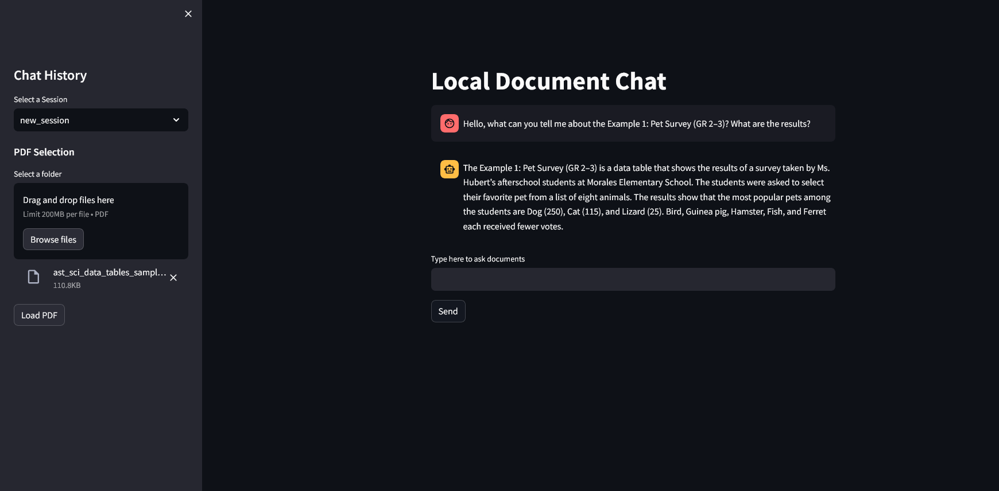

# Local PDF Chat Application

This Python Project, is aimed at Users or Companies that want to facilitate documentation QA by being able to chat with the files,
by using AI-Driven natural language processing,
With this application, a User can load multiple PDF Files and chat with them, asking questions about anything the User needs.

My idea for this project was that, in the future, companies could have a system like this, where workers can ask questions about protocols,
information regarding documentation, as well as to ease the spread of information by the use of AI.

### Features

    PDF Loading and Processing: Upload multiple PDFs which are processed into a vector database for querying.
    Conversational AI Interface: Use an AI chatbot interface to ask questions about the contents of the loaded PDFs.
    Session Management: Save and load chat history to continue conversations from where you left off.
    Customization and Configurations: Easily adjustable configurations via a YAML file.

- As of July 2024, this project was tested using Microsoft's Phi-3.1-mini-128k, achieving better results than the initial
mistral-7b model, being tested on a budget laptop with an Nvidia 1050ti and 16gb of ram.

- The Microsoft ML Model, Phi-3.1-mini-128k, achieved better results in half the time, even with the above-mentioned hardware,
 the model was able to load the pdf in about 3 minutes while only taking about 37 minutes to load a response to the question,
 being faster than mistral-7b, that took roughly 14 minutes to load the PDF File, and almost an hour and a half to give a response.
 With Phi-3.1-mini-128k also being lighter, at 2,62GB while "mistral-7b-instruct-v0.1.Q3_K_M" and "mistral-7b-instruct-v0.1.Q5_K_M" both used to test,
 had 3,27GB and 4,77GB, the Phi-3.1-mini-128k, was also monitored in terms of GPU Usage, using less resources of the laptop.

